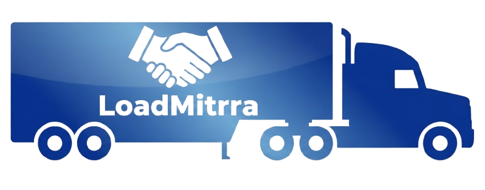
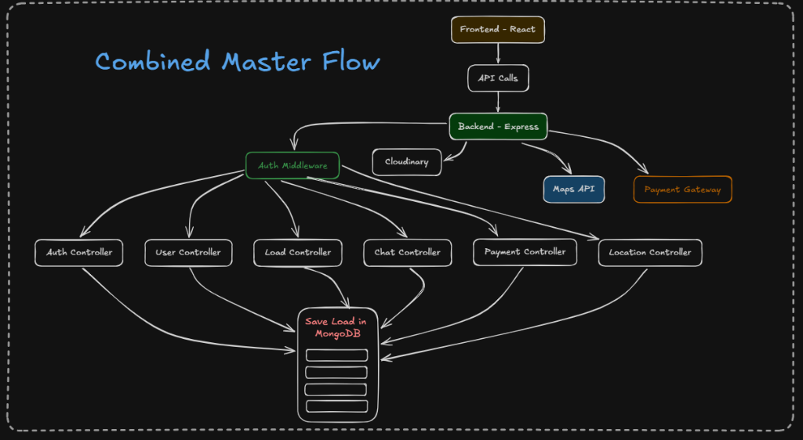
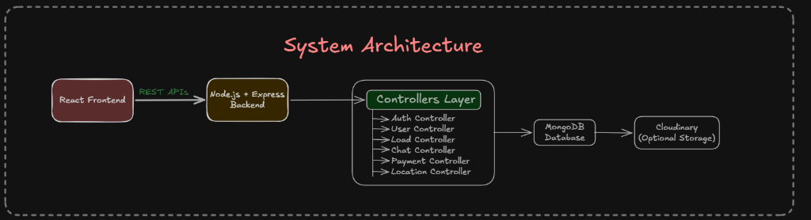
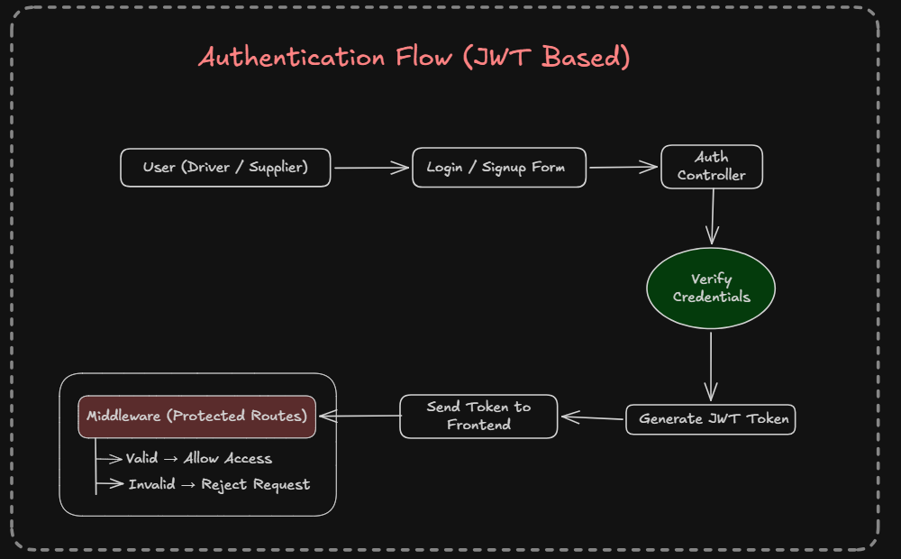
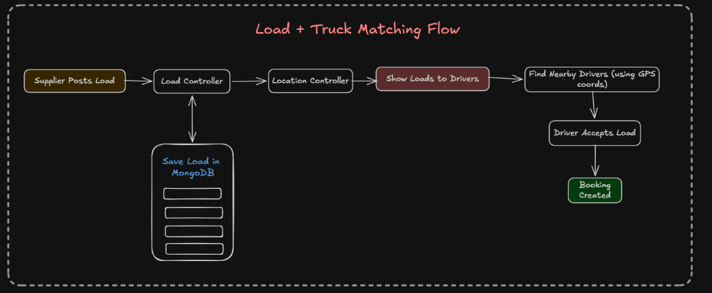
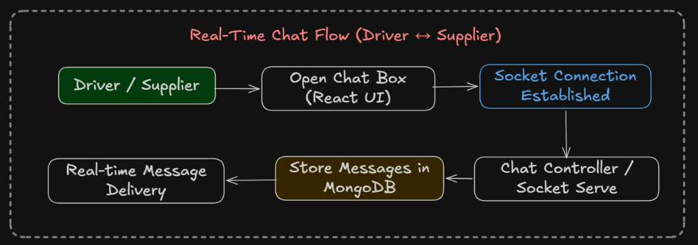

<div align="center">

#  LoadMitrra

### Full-Stack MERN Logistics & Freight Matching Platform

**Supplier & Driver Management System**

[](https://react.dev)
[](https://nodejs.org)
[](https://expressjs.com)
[](https://www.mongodb.com)
[](https://socket.io)
[](https://jwt.io)
[](https://getbootstrap.com)

---

*Connects Suppliers (businesses needing cargo transport) with Drivers (truck operators). Real-time load management, live chat, billing, and status tracking in a single unified web app.*

🌐 **Live Demo:** [loadmitrra.vercel.app](https://loadmitrra.vercel.app) &nbsp;|&nbsp; 🖥️ **API:** [loadmitrraapp.onrender.com](https://loadmitrraapp.onrender.com)

</div>

---

## ✨ Features

- 📦 **Smart Load Management** — Suppliers post loads (pickup/drop, weight, vehicle type, price) and drivers browse/accept them
- 💬 **Real-Time Chat** — Instant Socket.io powered messaging between assigned Drivers and Suppliers for active shipments
- 🚚 **Trip Lifecycle Tracking** — Live status updates from Driver side (Scheduled → In Transit → Reached Destination)
- 💳 **Billing System** — Suppliers view pending deliveries and trigger payments to unlock job completion
- 🔐 **Role-Based Auth** — Separate secure portals for Drivers and Suppliers using stateless JWT
- 🗺️ **Route Navigation** — Google Maps integration for Drivers to navigate to pickup and drop-off locations

---

## 🏗️ Architecture

### Combined Master Flow


### System Architecture


### Authentication Flow (JWT Based)


### Load & Truck Matching Flow


### Real-Time Chat Flow (Driver ↔ Supplier)


---

## 🚀 Deployment

| Service | Platform | URL |
|---------|----------|-----|
| **Frontend** | Vercel | [loadmitrra.vercel.app](https://loadmitrra.vercel.app) |
| **Backend API** | Render | [loadmitrraapp.onrender.com](https://loadmitrraapp.onrender.com) |

> 💡 **Render Free Tier Note:** The backend free tier spins down after 15 min of inactivity. The first request (like logging in) may take ~30s.

---

## 🛠️ Tech Stack

| Layer | Technology |
|---|---|
| **Frontend** | React 19, React Router DOM v7, Axios, Bootstrap 5 |
| **Backend** | Node.js, Express 5 |
| **Database** | MongoDB Atlas, Mongoose ODM |
| **Authentication** | JWT (JSON Web Tokens), bcryptjs |
| **Real-Time Layer** | Socket.io |
| **Maps & Location** | React Google Maps, Leaflet |
| **Deployment** | Vercel (Frontend), Render (Backend) |

---

## 📁 Project Structure

```
LoadMitrra/
├── Backend/                    # Node.js + Express API
│   ├── middleware/             # JWT + role verification
│   ├── model/                  # Mongoose Schemas (Driver, Supplier, Load, Chat)
│   ├── routes/                 # REST API Routes
│   ├── index.js                # App entry, HTTP & Socket.io server
│   └── .env.example
│
└── loadmitrra/                 # React Frontend
    ├── src/
    │   ├── api/                # Axios instance with auto token injection
    │   ├── auth/               # Login & Signup pages
    │   ├── driver_app/         # Driver-specific portal & contexts
    │   ├── supplier_app/       # Supplier-specific portal & contexts
    │   └── landing_page/       # Public marketing site
    └── package.json
```

---

## 🚀 Getting Started

### Prerequisites
- Node.js v18+
- A [MongoDB Atlas](https://www.mongodb.com/cloud/atlas) cluster
- A [Google Maps](https://developers.google.com/maps) API Key (optional for navigation)

### 1. Clone the repository

```bash
git clone https://github.com/asoleshubham0125/LoadMitrraApp.git
cd LoadMitrraApp
```

### 2. Setup the Backend

```bash
cd Backend
npm install
cp .env.example .env   # Fill in your actual values
npm start              # Start the Express & Socket server
```

### 3. Setup the Frontend

```bash
cd ../loadmitrra
npm install
cp .env.example .env   # Fill in your actual values
npm start              # Start the React dev server
```

---

## 🔑 Environment Variables

### Server (`Backend/.env`)

```env
PORT=5000
MONGO_URI=mongodb+srv://<user>:<password>@<cluster>.mongodb.net/<dbname>?retryWrites=true&w=majority
JWT_SECRET=your_super_secret_key
SESSION_SECRET=your_session_secret
GOOGLE_CLIENT_ID=your_google_oauth_client_id
```

### Client (`loadmitrra/.env`)

```env
REACT_APP_API_BASE_URL=http://localhost:5000/api
```

---

## 📡 API Reference

All protected routes require `Authorization: Bearer <token>` header.

### Auth Routes — `/api/auth`
| Method | Endpoint | Description |
|--------|----------|-------------|
| `POST` | `/signup` | Register driver/supplier |
| `POST` | `/login` | Login & receive JWT |

### Load Routes — `/api/load`
| Method | Endpoint | Auth | Description |
|--------|----------|------|-------------|
| `POST` | `/` | Supplier | Create a new load |
| `GET` | `/supplier/:id` | Supplier | Get all supplier's loads |
| `GET` | `/available` | Driver | Browse all open loads |
| `PUT` | `/accept/:loadId` | Driver | Accept a load |
| `PUT` | `/pay/:loadId` | Supplier | Mark payment as paid |
| `PUT` | `/complete/:id` | Driver | Mark load as completed |

### Chat Routes — `/api/chat`
| Method | Endpoint | Auth | Description |
|--------|----------|------|-------------|
| `GET` | `/:loadId` | Driver/Supplier | Fetch message history |
| `POST` | `/:loadId` | Driver/Supplier | Send a new message |

---

## 📦 Load Lifecycle

1. **`posted`** — Created by Supplier
2. **`assigned`** — Accepted by Driver
3. **`in_transit`** — Driver picks up cargo
4. **`reached_destination`** — Driver arrives at drop location
5. **`completed`** — Supplier pays, Driver marks job done

---

## 🧑‍💻 Author

**Shubham Asole**
- GitHub: [@asoleshubham0125](https://github.com/asoleshubham0125)
- LinkedIn: [Shubham Asole](https://www.linkedin.com/in/shubham-asole)
- Portfolio: [shubhamasoleportfolio.vercel.app](https://shubhamasoleportfolio.vercel.app)

---

<div align="center">

© 2026 Shubham Asole. All rights reserved.

⭐ If you found this project useful, please give it a star!

</div>
