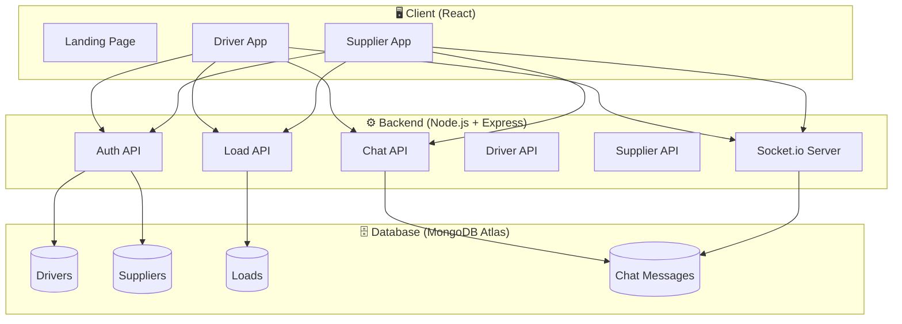
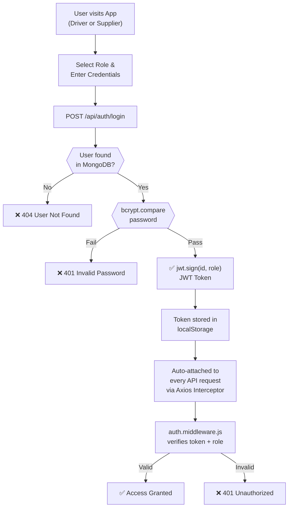
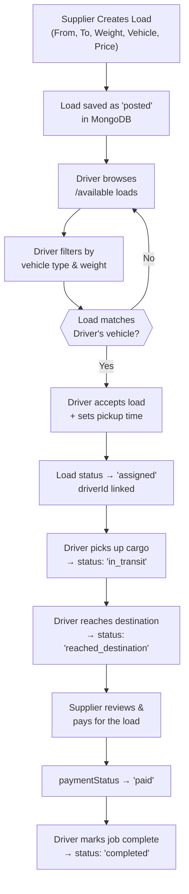
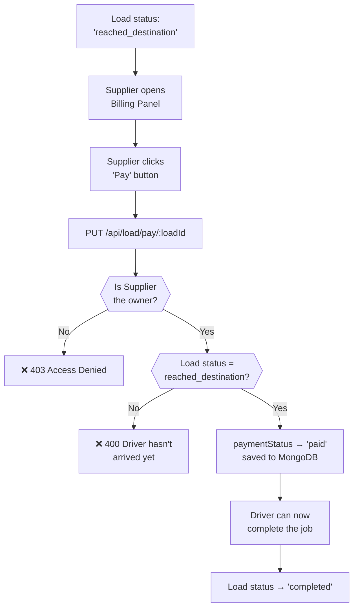
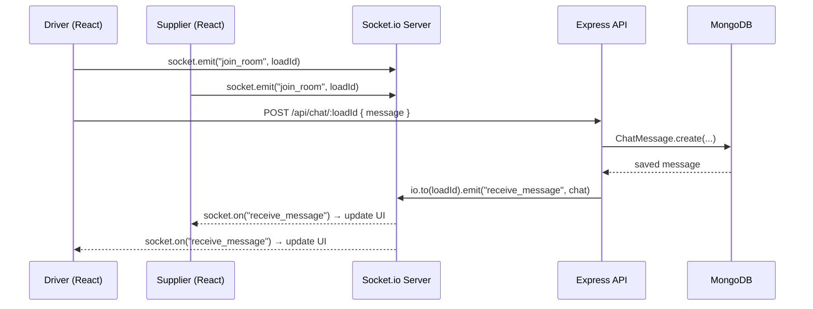
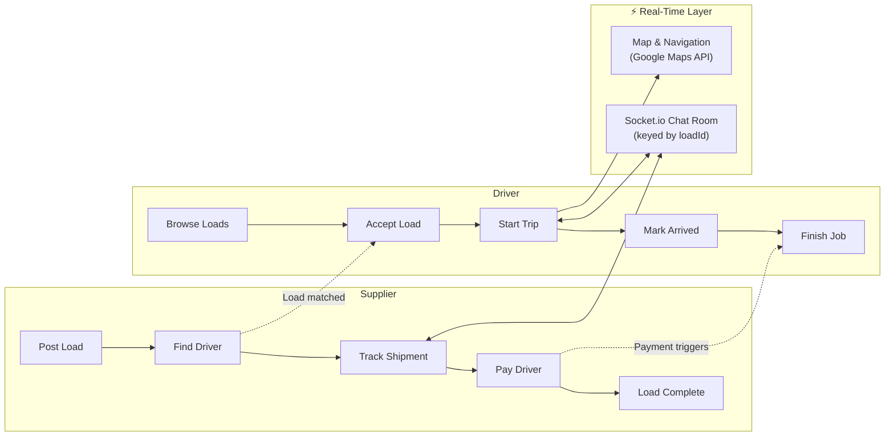

# 🚛 LoadMitrra

**LoadMitrra** is a full-stack MERN logistics platform that connects **Suppliers** (businesses needing cargo transport) with **Drivers** (truck operators). It provides real-time load management, live chat, route navigation, billing, and payment tracking — all in a single unified web app.

---

## 🌐 Live Demo

| Service   | URL                                          |
|-----------|----------------------------------------------|
| Frontend  | https://loadmitrra.vercel.app              |
| Backend   | https://loadmitrraapp.onrender.com           |

---

## ✨ Features

### 👤 Supplier Side
- **Post Loads** — Create shipment requests with pickup/drop locations, vehicle type, weight, and price
- **Active Shipments Panel** — Track live shipments with status badges (Finding Driver → Scheduled → In Transit → Reached Destination)
- **Load Details Panel** — View assigned driver's name, contact info; Call or Chat directly from the panel
- **Billing Panel** — View completed and pending deliveries; trigger payment for loads that have reached their destination
- **Real-Time Chat** — Instant Socket.io powered chat with the assigned driver on any active load

### 🚗 Driver Side
- **Available Loads** — Browse all open loads posted by suppliers and filter by vehicle type
- **Accept Load** — Accept a load and set a confirmed pickup time
- **My Loads Panel** — View all accepted loads with live status; Chat button directly on each card
- **Load Details Panel** — See supplier info, navigate to pickup or drop via Google Maps, and chat
- **Trip Lifecycle Actions** — Start Trip → Mark Reached → Finish Job (unlocks after payment)
- **Load History** — View all completed past deliveries

### 🔒 Authentication
- Separate login/signup flows for **Drivers** and **Suppliers**
- JWT-based stateless authentication with role-based access control (RBAC)
- Tokens stored in `localStorage` and auto-attached on every API request

### 💬 Real-Time Chat (Socket.io)
- Room-based architecture keyed by `loadId` — messages are scoped to a specific shipment
- Instant message delivery via `receive_message` socket events
- Messages persisted to MongoDB for history on re-open
- Access-controlled — only the assigned Driver and the Load's Supplier can chat

---

## 🏗️ Tech Stack

### Frontend
| Technology           | Purpose                          |
|----------------------|----------------------------------|
| React 19             | UI Framework                     |
| React Router DOM v7  | Client-side routing              |
| Axios                | HTTP API client                  |
| Socket.io Client     | Real-time chat                   |
| React Google Maps    | Interactive map & route display  |
| React Leaflet        | Alternate map layer              |
| React Toastify       | Toast notifications              |
| Bootstrap 5          | Component styling                |
| Material Symbols     | Icon library                     |

### Backend
| Technology   | Purpose                              |
|--------------|--------------------------------------|
| Node.js      | Runtime environment                  |
| Express 5    | HTTP server & REST API               |
| Socket.io 4  | WebSocket server for real-time chat  |
| Mongoose 9   | MongoDB ODM                          |
| MongoDB Atlas| Cloud database                       |
| bcryptjs     | Password hashing                     |
| jsonwebtoken | JWT auth tokens                      |
| dotenv       | Environment variable management      |
| nodemon      | Dev server auto-restart              |

## 🌐 Combined Master Flow


---

## 🗺️ System Architecture




---

## 🔐 Authentication Flow (JWT Based)




---

## 📦 Load + Truck Matching Flow




---

## 💳 Payment Flow



---

## 💬 Real-Time Chat Flow (Driver ↔ Supplier)




---

## 🔄 Combined Master Flow



---

## 📁 Project Structure

```
LoadMitrra/
├── Backend/                    # Node.js + Express API
│   ├── middleware/
│   │   └── auth.middleware.js  # JWT + role verification
│   ├── model/
│   │   ├── Driver.model.js
│   │   ├── Supplier.model.js
│   │   ├── Load.model.js
│   │   └── ChatMessage.model.js
│   ├── routes/
│   │   ├── auth.routes.js      # /api/auth (signup, login)
│   │   ├── load.routes.js      # /api/load (CRUD + status actions)
│   │   ├── chat.routes.js      # /api/chat (get & send messages)
│   │   ├── driver.routes.js    # /api/driver
│   │   └── supplier.routes.js  # /api/supplier
│   ├── index.js                # App entry, HTTP server, Socket.io setup
│   └── .env                    # Environment variables
│
└── loadmitrra/                 # React Frontend (Monorepo)
    └── src/
        ├── api/
        │   └── axios.js            # Axios instance with auto token injection
        ├── auth/                   # Login & Signup pages
        ├── driver_app/             # Driver-specific app
        │   ├── context/            # DriverAuthContext, DriverMapContext
        │   ├── overlays/           # ChatPanel, MyLoadsPanel, LoadDetailsPanel, etc.
        │   └── services/           # driverApi.js
        ├── supplier_app/           # Supplier-specific app
        │   ├── context/            # SupplierAuthContext
        │   ├── overlays/           # ChatPanel, ActiveShipmentsPanel, LoadDetailsPanel, etc.
        │   └── utils/              # shipmentStatusConfig
        └── landing_page/           # Public marketing site
```

---

## 🚀 Getting Started

### Prerequisites
- Node.js v18+
- npm
- A MongoDB Atlas cluster

### 1. Clone the Repository
```bash
git clone https://github.com/asoleshubham0125/LoadMitrra.git
cd LoadMitrra
```

### 2. Setup the Backend
```bash
cd Backend
npm install
```

Create a `.env` file in the `Backend/` directory:
```env
PORT=5000
MONGO_URI=mongodb+srv://<user>:<password>@<cluster>.mongodb.net/<dbname>?retryWrites=true&w=majority
JWT_SECRET=your_super_secret_key
SESSION_SECRET=your_session_secret
GOOGLE_CLIENT_ID=your_google_oauth_client_id
```

Start the backend server:
```bash
npm start
```

### 3. Setup the Frontend
```bash
cd ../loadmitrra
npm install
```

Create a `.env` file in the `loadmitrra/` directory:
```env
REACT_APP_API_BASE_URL=http://localhost:5000/api
```

Start the frontend dev server:
```bash
npm start
```

The app will be running at **http://localhost:3000**

---

## 🔌 API Endpoints

### Auth — `/api/auth`
| Method | Endpoint        | Description              |
|--------|-----------------|--------------------------|
| POST   | `/signup`       | Register driver/supplier |
| POST   | `/login`        | Login & receive JWT      |

### Loads — `/api/load`
| Method | Endpoint                           | Role     | Description                    |
|--------|------------------------------------|----------|--------------------------------|
| POST   | `/`                                | Supplier | Create a new load              |
| GET    | `/supplier/:supplierId`            | Supplier | Get all my loads               |
| GET    | `/supplier/:supplierId/active`     | Supplier | Get active shipments           |
| GET    | `/supplier/:supplierId/billing`    | Supplier | Get billing loads              |
| PUT    | `/pay/:loadId`                     | Supplier | Mark payment as paid           |
| GET    | `/available`                       | Driver   | Browse all open loads          |
| GET    | `/driver/:driverId`                | Driver   | Get my accepted loads          |
| GET    | `/driver/:driverId/history`        | Driver   | Get completed load history     |
| PUT    | `/accept/:loadId`                  | Driver   | Accept a load                  |
| PUT    | `/pickup/:loadId`                  | Driver   | Mark as picked up (in_transit) |
| PUT    | `/reached/:loadId`                 | Driver   | Mark as reached destination    |
| PUT    | `/complete/:loadId`                | Driver   | Mark load as completed         |

### Chat — `/api/chat`
| Method | Endpoint      | Role             | Description              |
|--------|---------------|------------------|--------------------------|
| GET    | `/:loadId`    | Driver/Supplier  | Fetch message history    |
| POST   | `/:loadId`    | Driver/Supplier  | Send a new message       |

---

## 📦 Load Status Lifecycle

```
posted ──► assigned ──► in_transit ──► reached_destination ──► completed
   ▲           ▲              ▲                  ▲                  ▲
Supplier    Driver          Driver            Driver           Driver
creates    accepts          picks             marks          marks done
 load       load             up             arrived       (after payment)
```

---

## 🛡️ Security
- All sensitive routes are protected by `auth.middleware.js`
- Role-based access: drivers cannot access supplier routes and vice versa
- Passwords are hashed with `bcryptjs` (salt rounds: 10)
- JWT tokens expire after **7 days**
- Chat access is restricted to the load's assigned driver and its supplier

---

## 🗺️ Planned / Future Features
- 🤖 **AI Pricing Engine** — Suggest optimal load prices using distance-based ML model
- 📍 **Live GPS Tracking** — Real-time driver location on map for suppliers
- 📁 **File Storage** — Cloudinary integration for truck documents and images (optional)
- 💳 **Online Payments** — Razorpay / Stripe integration for in-app payment
- ⭐ **Rating System** — Driver and supplier reviews post-delivery
- 🔔 **Push Notifications** — Notify drivers of new loads matching their vehicle

---

## 🤝 Contributing

1. Fork the repository
2. Create a new branch
3. Commit your changes
4. Open a Pull Request

---

## 👨‍💻 Author

**Shubham Asole**  
GitHub: https://github.com/asoleshubham0125  
Portfolio: https://shubhamasoleportfolio.vercel.app

---

## 📄 License

This project is licensed under the **ISC License**.

---

*Built with ❤️ for the Indian logistics industry*
